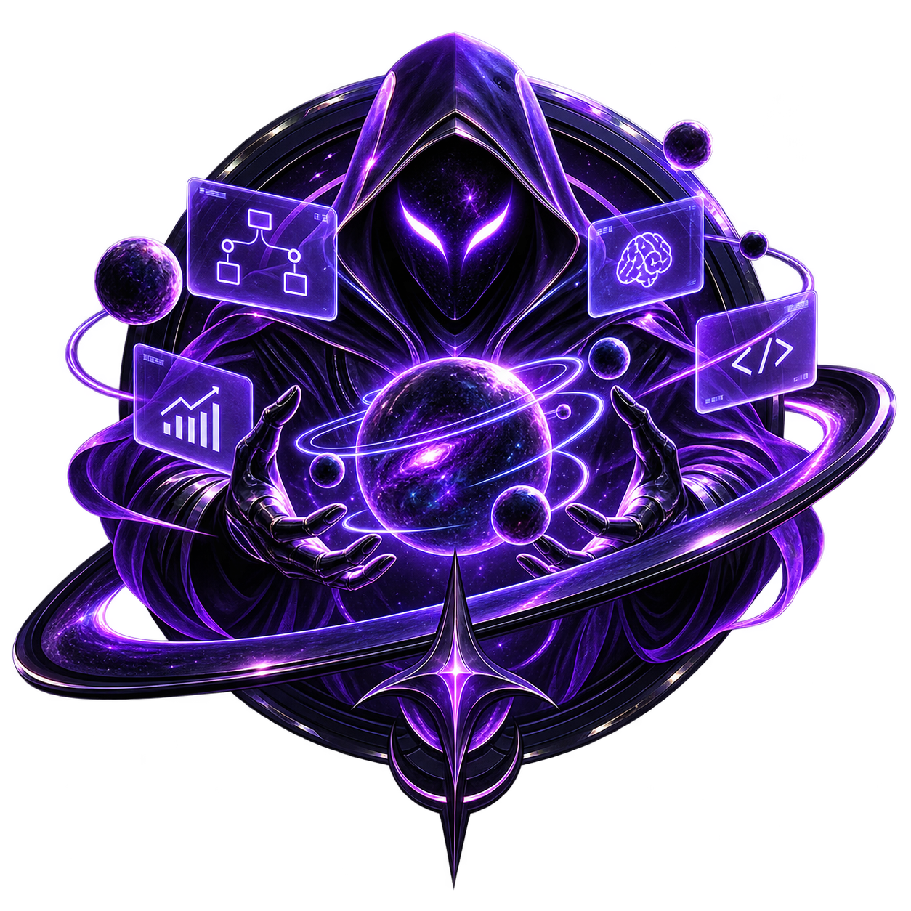

<a id="readme-top"></a>

<br />
<div align="center">
  <a href="https://github.com/theylor999/utopia-agent">
    
  </a>

  <h1 align="center">Utopia Agent</h1>

  <p align="center">
    <b>The multi-agent coding workspace.</b>
    <br />
    Run Oh My Pi, Grok Build and Claude Code side by side — in one local-first desktop app.
  </p>

  <p align="center">
    <a href="https://github.com/theylor999/utopia-agent/actions/workflows/ci.yml"></a>
    <a href="https://github.com/theylor999/utopia-agent/releases"></a>
    <a href="https://github.com/theylor999/utopia-agent/blob/main/LICENSE"></a>
    <a href="https://github.com/theylor999/utopia-agent/graphs/contributors"></a>
    <a href="https://github.com/theylor999/utopia-agent/stargazers"></a>
    <a href="https://github.com/theylor999/utopia-agent/issues"></a>
  </p>

  <p align="center">
    <a href="https://github.com/theylor999/utopia-agent/releases">Download</a>
    ·
    <a href="https://github.com/theylor999/utopia-agent/issues/new?labels=bug">Report Bug</a>
    ·
    <a href="https://github.com/theylor999/utopia-agent/issues/new?labels=enhancement">Request Feature</a>
    ·
    <a href="./SECURITY.md">Security</a>
    ·
    <a href="./docs/PRIVACY.md">Privacy</a>
    ·
    <a href="#contributing">Contribute</a>
  </p>
</div>

> [!IMPORTANT]
> Utopia Agent is a local-first desktop workspace. Update checks are off in this fork until a signed release pipeline exists. Provider usage polling can still contact Claude. Manual GitHub Gist Sync is already available. See [privacy and data-flow](./docs/PRIVACY.md).

<div align="center">
  
</div>

## What Utopia Agent Is

Utopia Agent is a desktop workspace for running coding agents in real terminals, with projects,
splits, MCP, and Git in one window.

This repository is a maintained fork of [Alethe](https://github.com/Kc1t/alethe-agents) by Kauã Miguel,
released under AGPL-3.0-or-later. The product name, icon, default providers, and GitHub destination
are specific to this fork.

Cross-platform (Windows, macOS, Linux), built with Tauri, Rust, React, and `xterm.js`.

“Local-first” describes workspace persistence, not an internet-free guarantee; see
[`docs/PRIVACY.md`](./docs/PRIVACY.md) for current network defaults, credentials, and retention.

## Supported Platforms

<table>
  <tr>
    <th width="33.33%">macOS</th>
    <th width="33.33%">Windows</th>
    <th width="33.33%">Linux</th>
  </tr>
  <tr>
    <td align="center">
      
    </td>
    <td align="center">
      
    </td>
    <td align="center">
      
    </td>
  </tr>
  <tr>
    <td align="center">Available on macOS</td>
    <td align="center">Available on Windows</td>
    <td align="center">Available on Linux</td>
  </tr>
</table>

## Agents

| Agent | CLI | |
|---|---|---|
| **OMP** | `omp` | Primary provider |
| **Grok Build** | `grok` | |
| **Claude Code** | `claude` | Session resume, usage cards, local history |
| **Shell** | pwsh / bash / zsh | The plain terminal, same pane model |

Missing CLIs can be installed, updated, and uninstalled from inside Utopia Agent. Already-installed
CLIs are discovered across PATH and common Windows install locations.

## What It Does

**Run agents in parallel**

- Projects, groups, and subgroups organize repositories; each open project becomes a container with
  its own panes.
- One agent per pane, or several agents as sub-tabs inside the same pane — each with its own PTY,
  working directory, and session.
- Auto, spotlight, sidebar, and custom grid layouts, editable directly on the grid.
- Closing a container hides it; the process keeps running.

**Keep the context**

- Sessions of Claude Code, Codex, and OpenCode resume after a crash or a restart.
- **Recent chats** lists the conversations of a pane's working directory and reopens any of them.
- A Claude Code conversation can be **handed off to Codex** (and back) through a locally redacted
  context packet — no copy-pasting the thread by hand. Redaction is best effort, so review the packet
  before starting the target agent.
- Scrollback is persisted per PTY, so reattaching shows what happened before.

**Manage what the agents share**

- **MCP tab**: every MCP server configured on the machine, grouped by server and showing which agents
  have it — read from Claude Code, Codex, and OpenCode configs. Add, remove, copy a server from one
  agent to another, search the official registry, and ask each agent to verify it can really reach a
  server. Every write is backed up, re-parsed, and committed atomically.
- **Skills tab**: the skills installed for each agent, with links and shared stores resolved so a
  shared skill shows up once.
- **Graphify**: a code graph of the project, served to the agents as an MCP server.

**Stay in control**

- RAM readout in the title bar; disable a terminal or suspend a whole group to get memory back.
- Git panel per project — status, stage, commit, branches, diffs in a pane — plus worktrees for
  parallel tasks.
- Content panes beside the terminals: file explorer, Markdown, diffs, images, video, embedded browser.
- Todos per project, isolated profiles, local backup export/import, 14 UI and terminal themes,
  EN and pt-BR.
- **Remote Control**: an authenticated LAN web view, paired by QR code, to follow and answer agents
  from your phone. It is off by default and uses unencrypted HTTP/WebSocket transport on the LAN, so
  enable it only on a trusted network. Clean profiles are read-only; answering agents requires a
  separate input opt-in, and shell input has its own additional opt-in.
- Spotify Now Playing, using your own Spotify app credentials in **Preferences ▸ Spotify** with
  `http://127.0.0.1:8888/callback` as the redirect URI. Current releases store those credentials in
  local profile files; see the privacy guide before exporting or sharing profile data.

## Core Concepts

| | |
|---|---|
| **Group** | A collection of projects that opens, collapses, and suspends together. |
| **Project** | A saved working context: terminals, layout, color, local state. |
| **Container** | The visible frame of an opened project. Closing it does not kill anything. |
| **Pane** | A terminal view inside a container. |
| **Sub-tab** | A separate agent or shell session inside the same pane. |
| **PTY** | The real backend process, alive independently of the UI. |

## Product Philosophy

A focused core with optional capabilities, closer to Obsidian than to a maximalist IDE. Non-essential
features ship behind feature flags or opt-in settings, and a clean installation stays a first-class
experience. Coherence over volume.

## Install

Use the published installers from [Releases](https://github.com/Kc1t/alethe-agents/releases).

> [!WARNING]
> Windows builds are **not code-signed yet**, so Defender may flag `alethe.exe` as
> `Trojan:Win32/Bearfoos.A!ml` and quarantine it. The `!ml` suffix denotes a machine-learning
> heuristic rather than a publisher signature, and terminal-multiplexer behavior such as spawning
> child processes and creating PTYs can produce false positives. Verify that the download came from
> the official Releases page; do not bypass a warning for an artifact from another source.

To recover it: **Windows Security → Virus & threat protection → Protection history → Actions →
Restore**, then add an exclusion for `%LOCALAPPDATA%\Alethe` (and `src-tauri/target` if you build
from source). Reports of incorrect detection go to
[Microsoft Security Intelligence](https://www.microsoft.com/wdsi/filesubmission). macOS builds are
not notarized yet either — right-click the app and choose **Open** to bypass Gatekeeper. Signing and
notarization are on the [roadmap](#roadmap).

## Run From Source

```sh
git clone https://github.com/Kc1t/alethe-agents.git
cd alethe-agents
npm install
npm run app
```

Requirements: Node.js 18+, Rust stable, Visual Studio Build Tools on Windows, Tauri system
dependencies on Linux:

```sh
sudo apt install -y libwebkit2gtk-4.1-dev libappindicator3-dev librsvg2-dev patchelf
```

```sh
npm run app          # desktop app with hot reload
npm run dev          # frontend only
npm run build        # typecheck + build frontend
npm run tauri build  # installers → src-tauri/target/release/bundle/
```

## Terminal Command

Install the `alethe` command from **Settings ▸ Integrations ▸ Terminal command**:

```bash
alethe                # opens the current folder as a project
alethe ~/some/project # opens the given folder
```

If the folder is already a project, it is brought into the workspace instead of duplicated. If Alethe
is already running, the existing window is focused. The command lands in `~/.local/bin/alethe`
(macOS/Linux) or `%LOCALAPPDATA%\Alethe\bin\alethe.cmd` (Windows) — reinstall it after moving the app.

## Roadmap

- [x] Multi-agent workspace with projects, groups, containers, and sub-tabs.
- [x] Real PTYs with spawn, attach, resize, scrollback, and session resume.
- [x] Agent install/update/uninstall, MCP and skills management.
- [x] Releases for Windows, Linux, and macOS.
- [ ] Windows release signing and macOS notarization.
- [ ] Broader Linux/macOS validation on real machines.
- [ ] First-party hosted cloud sync/backup (manual GitHub Gist Sync is already available).

## Contributing

Contributions are welcome. Read [`CONTRIBUTING.md`](CONTRIBUTING.md) for setup, project layout, and
house rules. The easiest ways to help:

- Pick an issue labeled [`good first issue`](https://github.com/Kc1t/alethe-agents/issues?q=is%3Aissue+is%3Aopen+label%3A%22good+first+issue%22) or [`help wanted`](https://github.com/Kc1t/alethe-agents/issues?q=is%3Aissue+is%3Aopen+label%3A%22help+wanted%22) — comment to claim it.
- Report a bug with clear reproduction steps, or request a feature with the workflow it improves.
- Improve docs, screenshots, and platform validation — Linux and macOS are the least tested.

For larger changes, open an issue first so the direction can be discussed.

## Built with Alethe

Projects and products built with Alethe as the workspace — agents running in parallel, shells alongside them, sessions resumed across days.

<!-- showcase:start -->

_Nothing here yet._ Built something with Alethe? Add it to [`SHOWCASE.md`](SHOWCASE.md) — it's one line and a pull request, and you end up in the contributors list too.

<!-- showcase:end -->

See [`SHOWCASE.md`](SHOWCASE.md) for the full list and how to submit.

## Watch Alethe in Action

See Alethe in real development workflows and learn how to orchestrate coding agents in parallel.

<table>
  <tr>
    <th width="38%">Video</th>
    <th>What you will see</th>
  </tr>
  <tr>
    <td>
      <a href="https://www.youtube.com/watch?v=8jvrucR7QCU&amp;t=54s">
        
      </a>
    </td>
    <td>
      <strong><a href="https://www.youtube.com/watch?v=8jvrucR7QCU&amp;t=54s">Stop Using One AI Agent at a Time: Orchestrate AI Agents</a></strong>
      <br><br>
      A practical introduction to coordinating multiple AI coding agents instead of working with only one at a time.
      <br><br>
      <sub>Kauã Miguel - Dev · Portuguese</sub>
    </td>
  </tr>
  <tr>
    <td>
      <a href="https://www.youtube.com/watch?v=reUN7CkMbgM&amp;t=100s">
        
      </a>
    </td>
    <td>
      <strong><a href="https://www.youtube.com/watch?v=reUN7CkMbgM&amp;t=100s">A Day in the Life of a Software Developer — Devlog 1</a></strong>
      <br><br>
      A real-world developer workflow showing Alethe as part of the day-to-day coding process.
      <br><br>
      <sub>Guilherme Dev · Portuguese</sub>
    </td>
  </tr>
</table>

## Contributors

Thanks to everyone helping shape Alethe.

<p align="center">
  <!-- contributors:start -->
  <a href="https://github.com/Kc1t"></a>
  <a href="https://github.com/MiguelSilvaPorto"></a>
  <a href="https://github.com/HayatoG"></a>
  <a href="https://github.com/slegarraga"></a>
  <a href="https://github.com/lucapohl-angel"></a>
  <a href="https://github.com/potatoiscompiled"></a>
  <a href="https://github.com/Jbnado"></a>
  <a href="https://github.com/theylor999"></a>
  <a href="https://github.com/chintanparmar011"></a>
  <a href="https://github.com/AshSgDe29071999"></a>
  <a href="https://github.com/rlevidev"></a>
  <a href="https://github.com/mapsiva"></a>
  <a href="https://github.com/moisesz10"></a>
  <a href="https://github.com/Bakurin0"></a>
  <a href="https://github.com/SrAmaral"></a>
  <a href="https://github.com/diegoliveiraa"></a>
  <a href="https://github.com/1arley"></a>
  <a href="https://github.com/VicktorMS"></a>
  <a href="https://github.com/rad4manthys"></a>
  <a href="https://github.com/lucianoschirmer"></a>
  <a href="https://github.com/lb1192176991-lab"></a>
  <a href="https://github.com/hgshreyas"></a>
  <a href="https://github.com/fernando-c-lima"></a>
  <a href="https://github.com/feejunior"></a>
  <a href="https://github.com/eudehh"></a>
  <a href="https://github.com/tomatotomata"></a>
  <a href="https://github.com/ThiagoSales17"></a>
  <a href="https://github.com/opedrooz"></a>
  <a href="https://github.com/devmatheusmota"></a>
  <a href="https://github.com/JohnPss"></a>
  <a href="https://github.com/GabrielKLopes"></a>
  <a href="https://github.com/floze-the-genius"></a>
  <a href="https://github.com/aryansk"></a>
  <!-- contributors:end -->
</p>

## License

The source code is distributed under **AGPL-3.0-or-later**. See [`LICENSE`](LICENSE) for details.
Official hosted services, such as sync, backup, billing, or cloud features, may be proprietary and
offered separately. The **Alethe** name, logo, and official branding are reserved for official builds
— see [`TRADEMARK.md`](TRADEMARK.md).

## Community

- Security reports: [`SECURITY.md`](SECURITY.md)
- Privacy and data flows: [`docs/PRIVACY.md`](docs/PRIVACY.md)
- Maintainer: [Kc1t](https://github.com/Kc1t)
- Project: <https://github.com/Kc1t/alethe-agents>
- Bugs and feature requests: <https://github.com/Kc1t/alethe-agents/issues>
