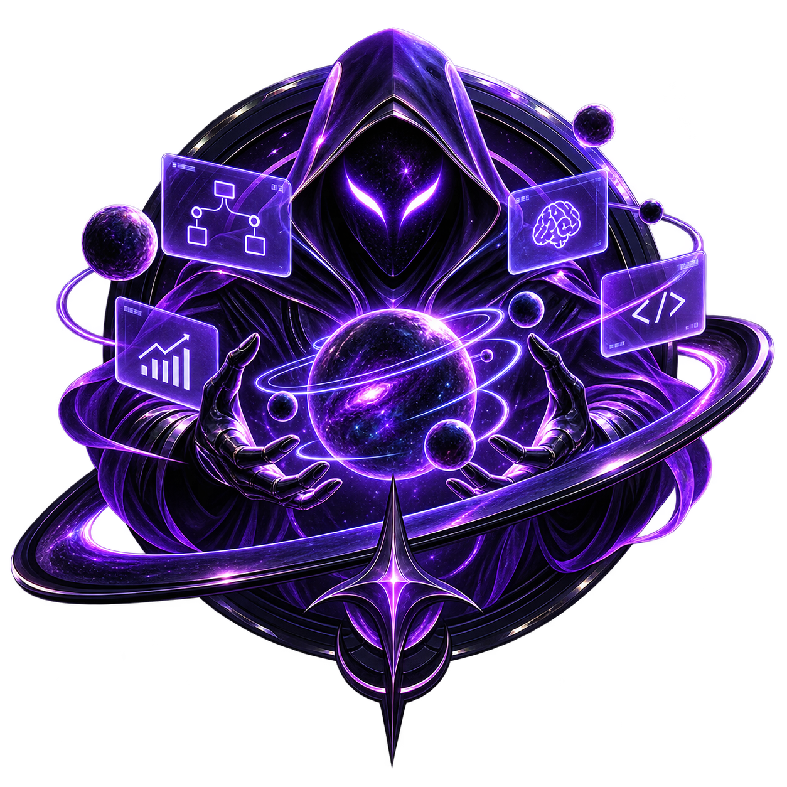

<a id="readme-top"></a>

<br />
<div align="center">
  <a href="https://github.com/theylor999/utopia-agent">
    
  </a>

  <h1 align="center">Utopia Agent</h1>

  <p align="center">
    <b>The multi-agent coding workspace.</b>
    <br />
    Run Oh My Pi, Grok Build, Claude Code and plain shells side by side, in real terminals, inside one
    local-first desktop app.
  </p>

  <p align="center">
    <a href="https://github.com/theylor999/utopia-agent/blob/main/LICENSE"></a>
    <a href="#install-windows"></a>
    <a href="#credits--upstream"></a>
    <a href="https://github.com/theylor999/utopia-agent/issues"></a>
    <a href="https://github.com/theylor999/utopia-agent/stargazers"></a>
  </p>

  <p align="center">
    <a href="#install-windows">Install</a>
    ·
    <a href="#new-feature--git-worktree-in-one-dialog">New feature</a>
    ·
    <a href="#develop">Develop</a>
    ·
    <a href="#credits--upstream">Credits</a>
    ·
    <a href="./SECURITY.md">Security</a>
    ·
    <a href="./docs/PRIVACY.md">Privacy</a>
    ·
    <a href="#contributing">Contribute</a>
  </p>
</div>

---

## What Utopia Agent is

Utopia Agent is a desktop workspace for coding agents. Every agent runs in a real terminal (a PTY),
inside a project you saved, in a layout you chose. Panes keep their working directory, their
scrollback, and their session, so closing a window does not lose the work.

It is built with Tauri 2, Rust, React and `xterm.js`, and it runs on Windows, macOS and Linux.
Windows is the most tested platform.

"Local-first" describes where the workspace state lives, not an internet-free guarantee. See
[`docs/PRIVACY.md`](./docs/PRIVACY.md) for the current network surfaces and defaults.

> [!NOTE]
> This repository is a maintained fork of [Alethe Agents](https://github.com/Kc1t/alethe-agents) by
> Kauã Miguel ([@Kc1t](https://github.com/Kc1t)), under AGPL-3.0-or-later. See
> [Credits / Upstream](#credits--upstream).

## Agents

| Agent | CLI | Notes |
|---|---|---|
| **Oh My Pi** | `omp` | The primary provider of this fork. |
| **Grok Build** | `grok` | |
| **Claude Code** | `claude` | Session resume, usage cards, local conversation history. |
| **Shell** | `pwsh` / `bash` / `zsh` | A plain terminal, in the same pane model. |

Utopia Agent finds the CLIs already installed on the machine — it searches `PATH` and the common
Windows install locations. A missing CLI can be installed, updated and uninstalled from inside the
app.

You choose the agent per pane, so a project can hold an `omp` pane, a `claude` pane and a shell at
the same time, each with its own process and working directory.

## New feature — Git worktree in one dialog

Starting a task usually means: create a branch, create a worktree, put it somewhere sensible, open
it, and repeat for every repository the task touches. **New feature** does all of it in one dialog.

Open it from the home screen ("New feature") or from a project's context menu in the sidebar, then:

1. **Pick the workspace type** — `Backend`, `Frontend`, `Backend + frontend`, or `Scripts`. Utopia
   Agent inspects your projects and suggests which one fits each role.
2. **Pick the source project** for each role. `Backend + frontend` takes two different repositories.
3. **Type a category and a name** — for example `fix` + `foo`, or `feature` + `foo-bar`. The branch
   is `category/name`, so `fix/foo` and `feature/foo-bar`. The category list offers `feature`, `fix`,
   `chore` and `refactor`, and accepts anything else you type.
4. **Read the plan preview** — the branch, the workspace folder, and the destination of every
   worktree, before anything is written to disk.

Press create, and the app does the rest by itself:

- Creates the branch and a **Git worktree** for every source repository, with `git worktree add`.
- Creates a workspace folder next to the main repository, named after the branch — `feature/foo-bar`
  becomes `feature-foo-bar/` — with one subfolder per role (`backend/`, `frontend/`, `scripts/`).
- Registers each worktree as a **project** in the workspace, opens a shell in it, and groups the
  projects together when the feature spans more than one repository.

Creation is transactional: if any step fails, the worktrees, branches and folders already created are
rolled back, and the error tells you which check failed — an existing branch, an occupied
destination, or a duplicated source repository.

## What it does

**Run agents in parallel**

- Projects, groups and subgroups organize repositories. Opening a project gives it a container with
  its own panes.
- One agent per pane, or several agents as sub-tabs inside one pane — each with its own PTY, working
  directory and session.
- Auto, spotlight, sidebar and custom grid layouts, editable directly on the grid.
- Closing a container hides it. The processes keep running.

**Keep the context**

- Agent sessions resume after a restart or a crash.
- **Recent chats** lists the conversations of a pane's working directory and reopens any of them.
- Scrollback is persisted per PTY, so reattaching shows what happened before.
- A conversation can be handed off between agents through a locally redacted context packet, instead
  of copy-pasting the thread. Redaction is best effort — review the packet before you start the
  target agent.

**Manage what the agents share**

- **MCP tab** — every MCP server configured on the machine, grouped by server, showing which agents
  have it. Add, remove, copy a server between agents, search the official registry, and ask an agent
  to verify it really reaches a server. Every write is backed up, re-parsed and committed atomically.
- **Skills tab** — the skills installed for each agent, with links and shared stores resolved so a
  shared skill appears once.
- **Graphify** — a code graph of the project, served to the agents as an MCP server.

**Stay in control**

- Git panel per project: status, stage, commit, branches, diffs in a pane, plus worktrees.
- RAM readout in the title bar. Disable a terminal or suspend a group to get memory back.
- Content panes beside the terminals: file explorer, Markdown, diffs, images, video, embedded
  browser.
- Todos per project, isolated profiles, local backup export/import, 18 UI and terminal themes,
  English and pt-BR.
- **Remote Control** — an authenticated LAN web view, paired by QR code, to follow and answer agents
  from a phone. Off by default, and it uses unencrypted HTTP/WebSocket on the LAN, so enable it only
  on a trusted network. Answering agents needs a separate opt-in, and shell input another one.
- Spotify Now Playing, with your own Spotify app credentials in **Preferences ▸ Spotify**.

## Core concepts

| | |
|---|---|
| **Group** | A set of projects that opens, collapses and suspends together. |
| **Project** | A saved working context: terminals, layout, color, local state. |
| **Container** | The visible frame of an opened project. Closing it kills nothing. |
| **Pane** | A terminal view inside a container. |
| **Sub-tab** | A separate agent or shell session inside the same pane. |
| **PTY** | The real backend process, alive independently of the UI. |

## Screenshot

<div align="center">
  
</div>

<sub>Screenshot inherited from the upstream project. Fork-specific screenshots are pending.</sub>

## Install (Windows)

This fork has no published installers yet, so you build it once from source. It takes one command
more than a download and it produces a normal desktop app.

```powershell
git clone https://github.com/theylor999/utopia-agent.git
cd utopia-agent
npm install
npm run tauri build
```

Then run the app that the build produced:

```
src-tauri\target\release\Utopia Agent.exe
```

The MSI and NSIS installers land in `src-tauri\target\release\bundle\`, if you prefer to install the
app instead of running it from the build folder.

**Requirements:** Node.js 18+, Rust stable, and Visual Studio Build Tools (MSVC). If `npm run tauri
build` cannot find the MSVC toolchain, run it inside the Visual Studio environment:

```powershell
cmd /c '"C:\Program Files (x86)\Microsoft Visual Studio\2022\BuildTools\VC\Auxiliary\Build\vcvars64.bat" >NUL && npm run tauri build'
```

On Linux you also need the Tauri system dependencies:

```sh
sudo apt install -y libwebkit2gtk-4.1-dev libappindicator3-dev librsvg2-dev patchelf
```

> [!WARNING]
> Builds of this fork are **not code-signed**, and macOS builds are not notarized. Windows Defender
> can flag a self-built binary through a machine-learning heuristic (`!ml`), because a terminal
> multiplexer spawning child processes and creating PTYs looks unusual. If that happens with a binary
> **you built yourself**, restore it under **Windows Security ▸ Virus & threat protection ▸
> Protection history**, and add an exclusion for `src-tauri\target`. Never bypass a warning for a
> binary you did not build and cannot trace.

## Develop

```sh
npm install
npm run app          # the desktop app with hot reload — the normal way to develop
npm run dev          # the frontend only
npm run build        # typecheck + build the frontend
npm run tauri build  # installers → src-tauri/target/release/bundle/
npm test             # unit tests
npm run lint         # eslint
```

`npm run app` runs the app under a separate identifier from the release build, so a dev session does
not touch your real workspace data.

## Terminal command

Install the `utopia-agent` command from **Settings ▸ Integrations ▸ Terminal command**:

```bash
utopia-agent                # opens the current folder as a project
utopia-agent ~/some/project # opens the given folder
```

If the folder is already a project, it is brought into the workspace instead of duplicated. If the
app is already running, the existing window is focused. The shim lands in
`%LOCALAPPDATA%\utopia-agent\bin\utopia-agent.cmd` on Windows, or `~/.local/bin/utopia-agent` on
macOS and Linux — reinstall it after moving the app.

## Where your data lives

Workspace state, profiles and scrollback live under the app's local data directory:
`%LOCALAPPDATA%\com.theylor.utopiaagent\profiles\<profile>\` on Windows. Each profile is isolated.
[`docs/PRIVACY.md`](./docs/PRIVACY.md) documents every file, every network call and its default.

> [!IMPORTANT]
> The startup update check is still active and points at this repository's releases. Until this fork
> publishes signed releases, it finds nothing. Provider usage polling can contact Claude.
> Manual GitHub Gist Sync is available and off by default.

## Docs

| | |
|---|---|
| [`docs/OVERVIEW.md`](./docs/OVERVIEW.md) | Architecture and workspace model. |
| [`docs/FEATURES.md`](./docs/FEATURES.md) | Feature reference. |
| [`docs/PRIVACY.md`](./docs/PRIVACY.md) | Data flows, network surfaces, retention. |
| [`docs/THEMES.md`](./docs/THEMES.md) | How to add a theme. |
| [`docs/BRAND.md`](./docs/BRAND.md) | Design tokens and assets. |
| [`docs/ROADMAP.md`](./docs/ROADMAP.md) | Direction. |
| [`docs/CHANGELOG.md`](./docs/CHANGELOG.md) | History, including the upstream history. |
| [`AGENTS.md`](./AGENTS.md) | Working guide for coding agents in this repository. |
| [`SHOWCASE.md`](./SHOWCASE.md) | Things built with Utopia Agent as the workspace. |

## Contributing

Contributions are welcome. [`CONTRIBUTING.md`](CONTRIBUTING.md) has the setup, the project layout and
the house rules. The easiest ways to help: report a bug with real reproduction steps, validate the
app on macOS or Linux, or improve the docs and screenshots.

For anything larger, open an issue first so the direction can be discussed.

## Staying current with upstream

Utopia Agent tracks Alethe Agents. This fork's work lives on the `custom/theylor` branch, and the
upstream remote is fetch-only:

```sh
git remote -v
# origin    https://github.com/theylor999/utopia-agent.git (fetch/push)
# upstream  https://github.com/Kc1t/alethe-agents.git (fetch)
# upstream  DISABLED (push)
```

To pull upstream changes in:

```sh
git checkout custom/theylor
git fetch upstream
git merge upstream/main
```

If the remote is not configured yet:

```sh
git remote add upstream https://github.com/Kc1t/alethe-agents.git
git remote set-url --push upstream DISABLED
```

Setting the push URL to `DISABLED` is deliberate: it makes an accidental `git push upstream` fail
instead of sending fork commits to the upstream repository. Resolve merge conflicts in favor of the
fork's product identity (name, icon, providers, GitHub destination) and in favor of upstream for
everything else.

## Credits / Upstream

**Utopia Agent is a fork of [Alethe Agents](https://github.com/Kc1t/alethe-agents), created by Kauã
Miguel ([@Kc1t](https://github.com/Kc1t)).** The architecture, the terminal engine, the workspace
model and the great majority of this codebase are his and his contributors' work. This fork changes
the product identity, the default agent providers, and adds features such as the New feature worktree
creator.

- Upstream project: <https://github.com/Kc1t/alethe-agents>
- Upstream author: [Kauã Miguel (@Kc1t)](https://github.com/Kc1t)
- Upstream contributors: [contributor graph](https://github.com/Kc1t/alethe-agents/graphs/contributors)
- Copyright notices, upstream included, are preserved in [`NOTICE`](NOTICE) and [`LICENSE`](LICENSE).

Everyone who shaped the code this fork is built on:

<p align="center">
  <!-- contributors:start -->
  <a href="https://github.com/Kc1t"></a>
  <a href="https://github.com/MiguelSilvaPorto"></a>
  <a href="https://github.com/HayatoG"></a>
  <a href="https://github.com/slegarraga"></a>
  <a href="https://github.com/lucapohl-angel"></a>
  <a href="https://github.com/potatoiscompiled"></a>
  <a href="https://github.com/Jbnado"></a>
  <a href="https://github.com/theylor999"></a>
  <a href="https://github.com/chintanparmar011"></a>
  <a href="https://github.com/AshSgDe29071999"></a>
  <a href="https://github.com/rlevidev"></a>
  <a href="https://github.com/mapsiva"></a>
  <a href="https://github.com/moisesz10"></a>
  <a href="https://github.com/Bakurin0"></a>
  <a href="https://github.com/SrAmaral"></a>
  <a href="https://github.com/diegoliveiraa"></a>
  <a href="https://github.com/1arley"></a>
  <a href="https://github.com/VicktorMS"></a>
  <a href="https://github.com/rad4manthys"></a>
  <a href="https://github.com/lucianoschirmer"></a>
  <a href="https://github.com/lb1192176991-lab"></a>
  <a href="https://github.com/hgshreyas"></a>
  <a href="https://github.com/fernando-c-lima"></a>
  <a href="https://github.com/feejunior"></a>
  <a href="https://github.com/eudehh"></a>
  <a href="https://github.com/tomatotomata"></a>
  <a href="https://github.com/ThiagoSales17"></a>
  <a href="https://github.com/opedrooz"></a>
  <a href="https://github.com/devmatheusmota"></a>
  <a href="https://github.com/JohnPss"></a>
  <a href="https://github.com/GabrielKLopes"></a>
  <a href="https://github.com/floze-the-genius"></a>
  <a href="https://github.com/aryansk"></a>
  <!-- contributors:end -->
</p>

Report bugs of **this fork** to
[theylor999/utopia-agent/issues](https://github.com/theylor999/utopia-agent/issues), not to the
upstream tracker. Bugs you can reproduce in upstream Alethe Agents belong upstream.

The **Alethe** name, logo and branding belong to the upstream project and are covered by its
[`TRADEMARK.md`](TRADEMARK.md). They are not used as the identity of this fork. The **Utopia Agent**
name and mark identify this fork's builds.

## License

The source code is distributed under **AGPL-3.0-or-later** — see [`LICENSE`](LICENSE). This is
inherited from upstream and unchanged.

## Community

- Security reports: [`SECURITY.md`](SECURITY.md)
- Privacy and data flows: [`docs/PRIVACY.md`](docs/PRIVACY.md)
- Maintainer of this fork: [@theylor999](https://github.com/theylor999)
- Project: <https://github.com/theylor999/utopia-agent>
- Bugs and feature requests: <https://github.com/theylor999/utopia-agent/issues>
